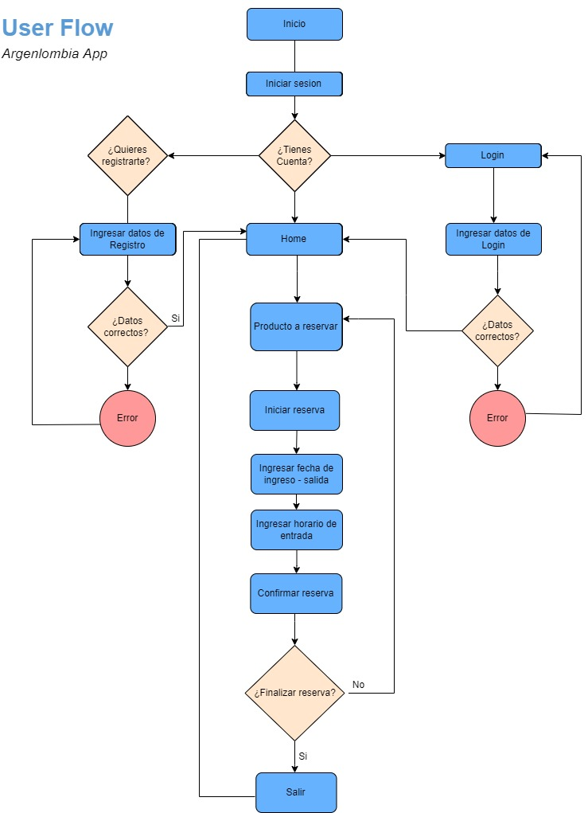
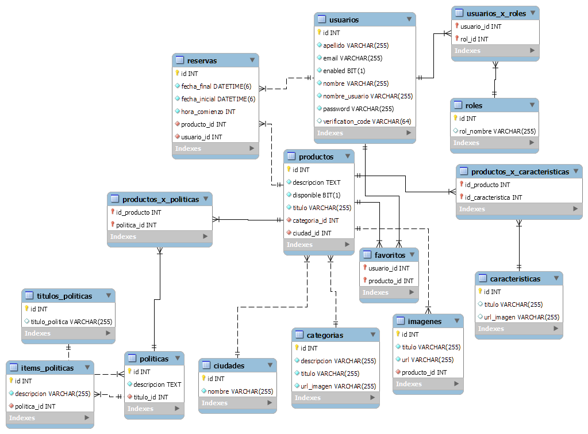
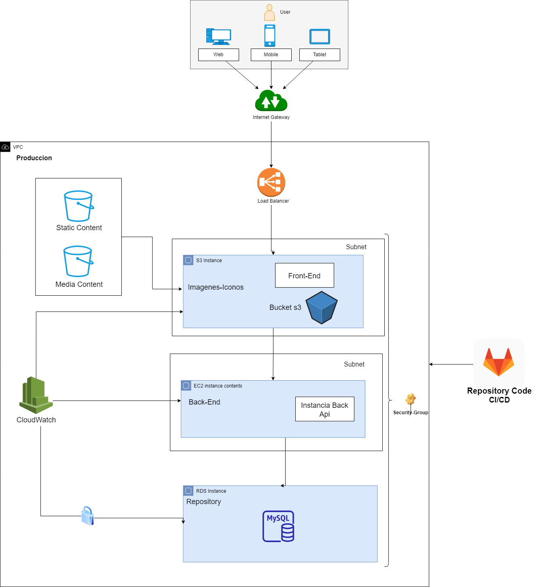

# Pagina principal

- **Nombre del proyecto:** ***Argenlombia App***

- **Resumen general del proyecto:**  Desarrollamos una aplicación web que le permite a los usuarios reservas de alojamiento en diferentes lugares del mundo y en la fecha que los usuarios requieran. 

- **Objetivo del grupo:**  
El objetivo que perseguimos como equipo es la buena comunicación, fomentando la colaboración en equipo y la sinergia. La buena comunicación nos permite ser más productivos y eficientes aparte de que se maneja un ambiente de trabajo más ameno. Para ello hicimos uso de todo lo aprendido en el curso de Certified Tech Developer tanto de las habilidades blandas como las habilidades técnicas, aplicando todo lo aprendido durante el año en el proyecto.

## Equipo

**JESSICA ORTIZ OSPINA**

Soy formada en ingeniería en Finanzas carrera la cual me formo con alto sentido analítico, con experiencia en trabajo en equipo, actualmente me encuentro haciendo la carrera Certified Tech Developer. El campo de la programación siempre me llamo la atención, porque todo lo que puedes imaginar lo puedes crear a partir de la programación, trayendo soluciones a los diversas necesidades de las personas. Con muchas ganas de seguir aprendiendo y poder así aportar innovadoras soluciones a las necesidades de las personas.
La experiencia de vivir en Brasil me trajo grandes aprendizajes, aprendí una nueva lengua (portugués), me permitió abrir la mente donde explore nuevas costumbres, y tradiciones, lo que me facilitó la interacción con las demás personas, vivir experiencias diferentes que me permitieron ver las cosas desde otra perspectiva y mejorar habilidades interpersonales como empatía, respeto y tolerancia. 
Actualmente también estoy estudiando Inglés tengo un nivel intermedio, este curso fue una beca que me gane en Brasil en la “Sociedade Brasileira de cultura Inglesa”.
Durante la ejecución del proyecto integrador trabaje principalmente en el área de frontend, realice tareas tales como:

- Maquetar y estilar componentes de react
- Darle funcionalidad a botones con resultados dinámicos.
- Elaborar formularios con sus respectivas validaciones.
- Implementar la librería del carrusel de imágenes, aunque  sepresentaron algunas complicaciones.
- Manipular los datos del formulario para enviarlos a la base de datos del Backend a través del submit.

| Tecnología | Fortaleza |
|------------|-----------|
Front end | :large_blue_circle: :large_blue_circle: 
Back end | :large_blue_circle: :large_blue_circle:
Infraestructura | :large_blue_circle:
Testing /QA | :large_blue_circle: 
Base de Datos | :large_blue_circle: :large_blue_circle:

**ERICK ADRIEL VAERNET**
Soy Licenciado en Biología y Técnico Universitario en Programación. 
Hasta el año 2020 me dedicaba a la investigación en la Universidad Nacional del Nordeste. En ese año descubrí mi pasión por el desarrollo y la programación web, y opté por dejar la investigación seguir lo que realmente me apasiona, de esta manera comencé mis estudios autodidactas, y a la par comencé a estudiar la carrera de técnico  universitario en programación.
A mitad de la carrera de técnico se me dio la oportunidad de comenzar la carrera Certified Tech Developer. Estudié ambas carreras a la par hasta el día de hoy que pude completar la Tecnicatura Universitaria en Programación y estar finalizando la primera parte de Certified Tech Developer, la cual me dio la mayoría de los conocimientos necesarios para desempeñarme en esta área.
En los diferentes sprint me desempeñe realizando diferentes tareas en el área de Backend, Base de Datos, FrontEnd, y en menor medida en Testing (realizando test unitarios para el backend).

| Tecnología | Fortaleza |
|------------|-----------|
Front end | :large_blue_circle: :large_blue_circle: :large_blue_circle:
Back end | :large_blue_circle: :large_blue_circle: :large_blue_circle:
Infraestructura | :large_blue_circle:
Testing /QA | :large_blue_circle: :large_blue_circle:
Base de Datos | :large_blue_circle: :large_blue_circle: :large_blue_circle:

**CELE SALCEDO**

Soy comunicadora Social e hice una especialización en Comunicación Institucional, lo que me permitió trabajar varios años en medios de comunicación como radio y televisión. Dentro del área de programación, comencé la carrera de Certified Tech Developer si tener ningún conocimiento previo. Esto realmente significó un mundo nuevo para mí, me ayudó a ver y analizar las cosas de una forma muy distinta a la que estaba acostumbrada. Me encantó el desafío, me queda muchísimo por aprender y conocer.
En cuanto a los roles desempeñados en el proyecto he tomado tareas pequeñas en el área del Front-End en los Sprint 1 y 2 y me he dedicado principalmente en el área de Testing realizando testeos manuales, exploratorios y automáticos, lo que me permitió refrescar algunos conocimientos adquiridos que por falta de práctica y de tiempo los tenía algo olvidados.

| Tecnología | Fortaleza |
|------------|-----------|
Front end | :large_blue_circle: :large_blue_circle: 
Back end | :large_blue_circle: :large_blue_circle:
Infraestructura | :large_blue_circle:
Testing /QA | :large_blue_circle: :large_blue_circle: :large_blue_circle:
Base de Datos | :large_blue_circle: 

**LUIS FELIPE ERIRA**

Soy técnico en salud ocupacional, tecnólogo en administración de sistemas informáticos y estudiante activo de último semestre de ingeniería de sistemas. Anteriormente me desempeñaba en el área de salud ocupacional en un hospital.
En el año 2018 quise darle un giro a mi carrera, principalmente por que me apasiona la tecnología y al ver la velocidad con la que está cambiando el mundo, la tecnología y los nuevos desarrollos, vi una excelente oportunidad para prepararme y de esta manera obtener estos nuevos conocimientos.
El primer paso fue terminar la tecnología en administración de sistemas informáticos y luego me postule a una beca con la alcaldía de Medellín de desarrollo FrontEnd, gracias a todo lo aprendido en el camino me enamore aun mas y por esta razón me postule a la carrera Certified Tech Developer, la cual es una excelente oportunidad para aprender y adquirir todos los conocimientos necesarios para desempeñarme en esta área, en los diferentes sprint me desempeñe en el área de FrontEnd realizando diferentes tareas y aplicando lo aprendido.

| Tecnología | Fortaleza |
|------------|-----------|
Front end | :large_blue_circle: :large_blue_circle: :large_blue_circle: 
Back end | :large_blue_circle: :large_blue_circle:
Infraestructura | :large_blue_circle:
Testing /QA | :large_blue_circle: :large_blue_circle: 
Base de Datos | :large_blue_circle: :large_blue_circle: :large_blue_circle: 

**AGUSTINA LEONELA**
Agustina Leonela
Soy licenciada en Biología Molecular, dedicada a la docencia y a la investigación científica. Actualmente me encuentro culminando el trabajo final de la Maestría en Educación en Entornos Digitales. Mi incursión en la programación se dió en el año 2020 con una beca de formación BackEnd para mujeres, con el fin de aplicar lo aprendido en mi entorno de trabajo. Sin embargo, mi curiosidad me llevó más allá y quise seguir aprendiendo, razón por la que me postulé para las becas de Certified Tech Developer, centrando mi interés principalmente en la programación BackEnd y en base de datos, las cuales describo como mis fortalezas. 
Durante el desarrollo de este proyecto, estuve abocada principalmente a las tareas de testing, tanto de Back y de Front. Dichas tareas fueron tales como la revisión de historias de usuario, creación de casos de prueba tanto para BackEnd como FrontEnd, realización de tests funcionales y no funcionales, Smoke Tests y Regression Tests. Automatización de pruebas de Front con Jest, procurando un coverage superior al 40%. Creación de peticiones y sets de pruebas para testeos de APIs con Postman. 

| Tecnología | Fortaleza |
|------------|-----------|
Front end | :large_blue_circle: :large_blue_circle:  
Back end | :large_blue_circle: :large_blue_circle:
Infraestructura | :large_blue_circle:
Testing /QA | :large_blue_circle: :large_blue_circle: :large_blue_circle:
Base de Datos | :large_blue_circle: :large_blue_circle: :large_blue_circle: 

**GREGO MARTINEZ**

| Tecnología | Fortaleza |
|------------|-----------|
Front end | :large_blue_circle: :large_blue_circle:  
Back end | :large_blue_circle: :large_blue_circle: :large_blue_circle:
Infraestructura | :large_blue_circle: :large_blue_circle: :large_blue_circle:
Testing /QA | :large_blue_circle: 
Base de Datos | :large_blue_circle: :large_blue_circle: :large_blue_circle: 

### Metodología de trabajo

- **Metodología de trabajo Scrum resultados positivos:**

En cuanto a las daily  fueron muy útiles ya que nos permitía estar informados de como va cada integrante del equipo con la tarea que le correspondía y a su vez nos permitía exponer las dificultades que teníamos o que se nos presentaron durante la ejecución de las issues.

Las reuniones diarias nos permitieron resolver dudas en equipo para así poder avanzar, sin contar que por fuera también nos reuníamos para resolver dudas y dificultades.

Las entregas parciales fueron de gran utilidad ya que nos permitía establecer objetivos en plazos cortos, recibir feedback constantemente y mejorar la app.

- **Puntos negativos:**
En el segundo sprint las issues  que montaron en el git-lab faltaban subdivisiones en la parte del front ya que habían unas issues bastante cargadas con diferentes tareas en una sola.

- **Asignación de roles dentro del equipo:** Desde el inicio del sprint decidimos asignar roles dentro del equipo pero siempre abiertos para los que quisieran ejercer más adelante un rol diferente, el rol lo escogió cada persona dependiendo del área en que se sintiera más cómodo y/o tuviera más interés en aprender y practicar. Al momento de repartir las tareas cada uno escogía según su rol la tarea que deseaba realizar y una vez se concluía la tarea se tomaba otra.

- **En cuanto a los acuerdos que llegamos como equipo fueron los siguientes:**
  -	Para gestionar el control de versiones creamos una rama llamada Develop, a partir de esta rama creamos subramas con un nombre relacionado a la issue que se tomaba, una vez culminada la issue se hace merge con la develop. Al final cuando ya este todo terminado pasariamos lo que tenemos en la rama develop para la main. Por otro lado siempre se informaba a los miembros del equipo cuando se hacia un push a la develop para que los demás miembros hicieron pull de los cambios.
  -  **Para normalizar el código en cuanto a front** el importe de los paquetes iban hacer en el siguiente orden primero los importes propios de react y react router dom, segundo los importes de librerías externas como por ejemplo react-icons y Axios, tercer lugar los importes de componentes internos y css.
    Cada componente en front debía estar dentro de una carpeta con el mismo nombre del componente y con su respectivo css.
    Manejar la identación que facilite la lectura del código.

    ### Bitácora del proyecto

    Cada sprint fue un desafío pero sin lugar a dudas el sprint 3 fue el que tenía más grado de dificultad. Cuando teníamos algún problema y no sabíamos como solucionarlo acudimos a los respectivos tech leaders.
    Durante el primer y segundo sprint la ejecución de las tareas fluyeron en general bien, tuvimos algunas complicaciones pero luego las supimos sobrellevar.
    En el tercer sprint fue el que nos resultó un poco más complejo, se nos presentaron algunas complicaciones con el multi-date-picker y con el filtrado de ciudad y fechas.
    En el cuarto sprint….

     - La fortaleza del equipo fue la constante comunicación y el apoyo en el equipo cuando alguna dificultad se presentaba. La empatía, la colaboración y la sinergia fueron pilares para llegar a culminar con el proyecto ya que los esfuerzos con estas fortalezas se potencia.

    - Contar puntualmente algo que consideren que haya sido un éxito:
    Si bien algunos integrantes tenían más conocimientos sobre alguna área determinada,  ya sea de front, back, etc, el equipo trató y probó de trabajar en otras , para que no se forme un cuello de botella, sobre todo en el front-end.
    El respeto entre los integrantes del equipo y la humildad de aceptar que hay cosas que no sabían y en consecuencia pedir ayuda.

    -  Las debilidades que tuvimos en el equipo fue la falta de conocimiento en el área de infraestructura y algunos en React , que fueron solucionadas ya que llevaron a cabo las acciones necesarias para adquirir los conocimientos y poder así ejecutar las tareas.

    ### Tecnologías utilizadas

    - **Gestión del proyecto:**
        - Discord (Colearning y para compartir información)
        - Zoom (Reuniones)
        - Board de Git-lab
        - WhatsApp (Comunicación)
        - Google Meet

    - **Desarrollo del Proyecto:**
        - IDEs: Visual Studio Code  e Intellij IDEA.
        - Sistemas de control de versiones: Git-lab.
        - Simulación/Virtualización: Cuenta cliente en AWS (Amazon Web Service).

    - **Tecnologías utilizadas para el desarrollo del sitio por área:**

        **Frontend:** Para el desarrollo de este proyecto se uso desde el área de frontend las siguientes tecnologías como IDE se uso VSC, las librerías que fueron usadas fueron React para el armado de los componentes en jsx y trabajamos con componentes auxiliares en js para esto se uso la librería de Node.js., por otro lado también usamos las librerías Axios, React icons, multi-date-picker (para el calendario), react carousel minimal (para el carrusel de imágenes).

        **Backend:** Desde el área de Backend se uso el IDE Intellij IDEA, el lenguaje que se uso fue Java. Trabajamos con Spring Framework  moderando el proyecto a través de Spring Boot. 

        **Base de datos:** Desde el área de Base de datos se especifican los siguientes requerimientos, como GUI (graphical user interface) usamos Workbench, como sistema de gestión de bases de datos relacionales usamos MySQL.

        **Infraestructura:** 
        Desde la infraestructura  se desplego la aplicación usando los servicios de AWS (Amazon Web Service) cuenta cliente
        Usamos el servicio RDS el cual nos permite alojar la base de datos MySQL, facilitando las tareas de configuración, operación y escalado en la nube, utilizamos el servicio S3 para alojar el contenido estático como son las imágenes de los productos (las categorías). Desde amazon web service  se hizo uso de todos estos recursos, se crearon las instancias, las subnets y la key para acceder por ssh mediante terraform, para que todos los miembros del grupo puedan ver los cambios que se hacen en la infraestructura.

        **Testing:** En el área de testing se usaron de las siguientes tecnologías
        Se uso la librería Jest para realizar los test de pruebas unitarias en Js y react. Para realizar las pruebas a la API usamos la aplicación Postman.
        Utilizamos el software Selenium para grabar las pruebas sin usar scripting.

        ### Documentación técnica del proyecto

        

        **Ambiente de desarrollo**
 
        Para el desarrollo de este proyecto recomendamos:
        - Una PC con 4Gb RAM como mínimo, recomendable 8Gb de RAM. Para el almacenamiento del proyecto se recomienda 5Gb.
        - Se recomienda tener instalado en el computador un emulador como GitBash.
        - En cuanto al control de versiones tener una cuenta en la plataforma de GitLab. Los cambios se iban subiendo a la rama Develop y al final se sube todo para la main.
        - Recomendamos trabajar con el navegador de Chrome.
        - En cuanto a la estructura de las carpetas la podemos encontrar dividida en áreas Backend, Frontend, Infraestructura y testing. Para acceder a cada una solo basta con especificar el nombre de la ruta. 
 

        **Frontend**

        En el área de frontend se requiere los siguientes software:
        - IDEs: Visual Studio Code (VSC)
        - Node.js
        - React.js
 
    Una vez se ejecuta el comando “npm install” en la consola de VSC podrá acceder al package con todas las librerías y funcionalidades utilizadas. Luego de ejecutado el anterior comando podemos correr el proyecto con el comando “npm start” de esta forma podremos visualizar en el browser la app. Dentro de la carpeta de Frontend podrá encontrar un pequeño instructivo (Readme) de como son los primeros pasos usando Create React App.
    Por otro lado en el componente App.js reúne todas las rutas y componentes utilizado en el proyecto.

    **Backend**

    En el área de Backend se especifican los siguientes requerimientos:
    IDEs: Intellij IDEA
    Java como lenguajes
    Se recomienda mantener actualizado el pom.xml ya que este contiene las dependencias requeridas del proyecto y las gestiona.
    Se acordó nombrar las clases, propiedades y métodos en español.

    **Base de datos**

    En el área de Base de datos se especifican los siguientes requerimientos:
    - MySQL
    - IDEs:Workbench

    Se recomienda mantener actualizada la query la cual contiene todos los datos preestablecidos  y almacenados en la base para el correcto funcionamiento del proyecto.
    Para la gestión de la base de datos relacional usamos MySQL y como herramienta visual de diseño y gestión de base de datos usamos Workbench.
    Acordamos mantener unificados los datos nombrándolos en español para mejor entendimiento de tablas.

    Scripts / instrucciones para la creación de la base de datos:
    La base de datos se carga directamente desde Spring-Boot.

    **Diagrama de la base de datos**

    

    **Infraestructura**

    En el área de Infraestructura  se especifican los siguientes requerimientos:
    -  AWS (Elastic Beanstalk, RDS con MYSQL, 2 unidades S3 (Front-end e Imagenes), EC2 con API Back-end  )
    - Git-Lab Pipelines para integración y despliegue continuo.

    **Estructura y Diagramas Infraestructura:**

    
    

    **Testing**

    Para evitar que los errores lleguen al cliente se realizaron pruebas frecuentes en el proceso de desarrollo de cada sprint, usamos Jest para realizar los test de pruebas unitarias de cada uno de los componentes que conforman el front, para el testeo de las APIs usamos la aplicación de Postman. También, teniendo en cuenta las distintas  historias de usuario presentadas, se elaboraron casos de prueba para cada Sprint, que consistieron tanto en pruebas funcionales como no funcionales, ya sea para Smoke Testing, en el caso de testeo de nuevas funcionalidades, como para Regression Testing, en lo que respecta a las pruebas sobre funcionalidades de sprints anteriores.
    Para el caso de pruebas automatizadas usamos Selenium.

    **Informe de testing:**

    
 

 

